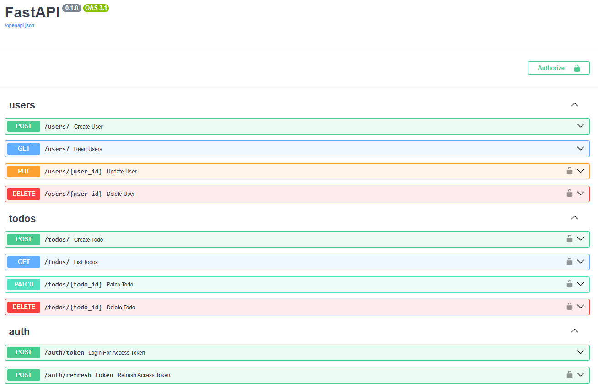
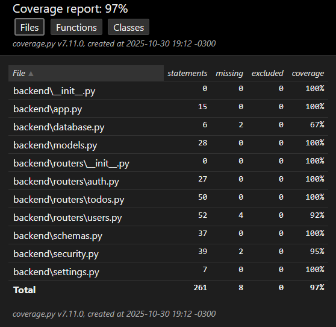

# ✅ FastAPI To-Do System (Sistema de Tarefas Assíncrono)

Este projeto é um **template de backend moderno**, construído com **FastAPI**, para gerenciamento completo de tarefas (*To-Do List*). Ele segue as melhores práticas de desenvolvimento assíncrono em Python e utiliza **contêineres Docker** para simplificar o ambiente de desenvolvimento.

---

## ✨ Destaques do Projeto

* **Assincronicidade Completa (`async/await`)**: Todo o backend é assíncrono, desde o servidor FastAPI até o acesso ao banco de dados, garantindo alta performance e não-bloqueio do *event loop*.
* **SQLAlchemy 2.0 Assíncrono**: Uso de `AsyncSession` e *Declarative Mapped* para modelos e persistência de dados eficiente.
* **Segurança (JWT)**: Autenticação e autorização via **JSON Web Tokens**, integrada à injeção de dependência do FastAPI.
* **Contêinerização Profissional**: Configuração robusta com **Docker e Docker Compose** para replicabilidade e isolamento do ambiente.
* **Testes Automatizados**: Suíte completa de **testes unitários e de integração** com **Pytest** e *fixtures* assíncronas. Garantia de funcionamento de todas as rotas CRUD e autenticação.
* **Cobertura de Testes**: O projeto inclui análise de cobertura (*coverage*), demonstrando a porcentagem de código testado (última imagem).

---

## ⚙️ Tecnologias Principais

| Categoria | Ferramenta | Propósito |
| :--- | :--- | :--- |
| **Framework** | FastAPI | API de alta performance com documentação automática. |
| **BD & ORM** | PostgreSQL & SQLAlchemy (Async) | Persistência de dados assíncrona e eficiente. |
| **Gerenciamento de Pacotes** | `uv` (Rúst) | Instalação e gestão de dependências rápida. |
| **Segurança** | JWT (`python-jose`) & `pwdlib` | Autenticação e hashing seguro de senhas. |
| **Contêineres** | Docker & Docker Compose | Ambiente isolado e replicável. |
| **Migrações** | Alembic | Controle de versão do esquema do banco. |
| **Testes** | Pytest & pytest-asyncio | Execução de testes unitários e de integração. |

---

## 🚀 Como Executar o Projeto (Docker Compose)

### Pré-requisitos
* Docker e Docker Compose instalados.

### 1. Clonar e Construir
```bash
git clone https://github.com/kaynanxd/FastAPI-To-do-System
cd FastAPI-To-do-System

# Construir e subir os contêineres
docker compose build
docker compose up -d
```

### 2. Acessar a API
* **Servidor**: http://127.0.0.1:8000  
* **Swagger UI (Documentação Interativa)**: http://127.0.0.1:8000/docs  


### 3. Executar Testes Unitários
```bash
# Dentro do container da aplicação ou no ambiente local
pytest --cov=app tests/
```
*Exibe a cobertura dos testes, garantindo que o código principal foi testado adequadamente.*  

